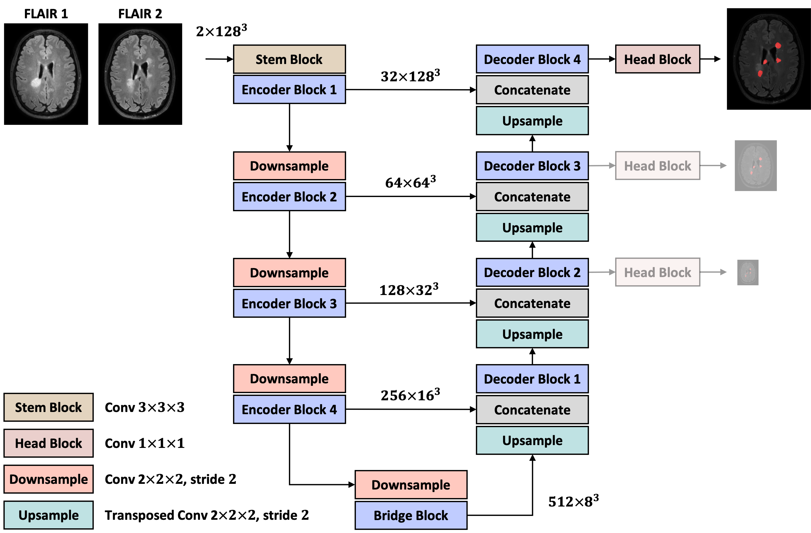

# xunet

## Description
xU-Net is a simple modular library to flexibly generate U-Net architectures for medical image segmentation. This repo also includes top-performing solutions to the [MSSEG-2 MICCAI challenge](https://portal.fli-iam.irisa.fr/msseg-2/).




## Installation
```bash
$ pip install git+https://github.com/pashtari/xunet.git
```


## Data Preparation

Before training models on the MSSEG-2 dataset, we first need to prepare the dataset by taking the following steps:

1. Register to download the official MSSEG-2 dataset through [this link](https://portal.fli-iam.irisa.fr/msseg-2/).

2. Download the data properties [JSON file](./bin/dataset.json) and place it in the dataset folder according to the structure

```bash
MSSEG-2
├── dataset.json # data properties 
└── training
    ├── 013 # 1st subject
    │   ├── flair_time01_on_middle_space.nii
    │   ├── flair_time02_on_middle_space.nii
    │   └── ground_truth.nii
    ├── 015 # 2nd subject
    │   ├── flair_time01_on_middle_space.nii
    │   ├── flair_time02_on_middle_space.nii
    │   └── ground_truth.nii
    └── ...
```


## Training
To train a model from the terminal:

```bash
cd ./bin
python train.py --config config.yaml
```

where `config.yaml` is the config file. You can find the config files in [./bin/configs](./bin/configs), but before using them, change their values of `data_properties` to yours. 

**Example.** The first fold of a 5-fold cross-validation to train Pre-U-Net on the MSSEG-2 dataset using two GPUs is done by 

```bash
cd ./bin
python train.py --config configs/msseg2/config_msseg2_fold0_preunet.yaml
```
The model checkpoints will then be saved in `./bin/logs/msseg2/fold0/preunet/version_0/checkpoints`, which is specified in the config file.


## Trained Models

All the trained models and results can be downloaded via the [OneDrive link](https://kuleuven-my.sharepoint.com/:f:/g/personal/pooya_ashtari_kuleuven_be/Eqt9kgnovgRHqxyILLU9BoQB6PVH0UZw6HXLejdixVWBaw?e=flgH4R), as a folder named `logs` (Currently, the checkpoints for the models trained on the MSSEG-2 datasets are available). Once you downloaded the `logs` folder, place it inside the folder [./bin](./bin).

```bash
bin
├── configs
│   └── msseg2
│       ├── config_msseg2_fold0_preunet.yaml
│       └── ...
├── logs
│   └── msseg2
│       ├── fold0
│       │   ├── preunet
│       │   │   └── version_0
│       │   │       ├── checkpoints
│       │   │       │   └── epoch=6249-step=99999.ckpt
│       │   │       ├── results.csv
│       │   │       └── ...
│       │   └── ...
│       └── ...
├── registry.py
├── train.py
├── validate.py
└── ...
```


## Validation

**Example.** The first fold of 5-fold cross-validation to validate Pre-U-Net on the MSSEG-2 dataset using two GPUs is done by

```bash
cd ./bin
python validate.py --config configs/msseg2/config_msseg2_fold0_preunet.yaml
```
The validation scores will then be saved as `./bin/logs/msseg2/fold0/preunet/version_0/results.csv`. A valid checkpoint path is required to perform a validation loop. In this example, as specified in the config file, the path to the checkpoint is `logs/msseg2/fold0/preunet/version_0/checkpoints/epoch=6249-step=99999.ckpt`. To 


## Inference for New MS Lesion Segmentation

1. Download all the trained models via the [OneDrive link](https://kuleuven-my.sharepoint.com/:f:/g/personal/pooya_ashtari_kuleuven_be/Eqt9kgnovgRHqxyILLU9BoQB6PVH0UZw6HXLejdixVWBaw?e=flgH4R) as a folder named `logs` and place it inside the folder [./bin](./bin), that is

```bash
bin
├── configs
│   └── msseg2
│       ├── config_msseg2_fold0_preunet.yaml
│       └── ...
├── logs
│   └── msseg2
│       ├── fold0
│       │   ├── preunet
│       │   │   └── version_0
│       │   │       ├── checkpoints
│       │   │       │   └── epoch=6249-step=99999.ckpt
│       │   │       ├── results.csv
│       │   │       └── ...
│       │   └── ...
│       └── ...
├── registry.py
├── predict_msseg2.py
└── ...
```

2. To make predictions for a test case on CPU, run the following command:

```bash
$ cd ./bin
$ python predict_msseg2.py -c ${config.yaml} -t1 ${flair1} -t2 ${flair2} -o ${output}
```

**Example.** You can do inference using the ensemble of Pre-U-Net models pre-trained during the 5-fold cross-validation by

```bash
cd ./bin
python predict_msseg2.py --config config_msseg2_ensemble_preunet.yaml -t1 ${flair1} -t2 ${flair2} -o ${output}
```


## License

This repository is released under the Apache 2.0 license as found in the [LICENSE](LICENSE) file.


## Contact

This repo is currently maintained by Pooya Ashtari ([@pashtari](https://github.com/pashtari)).
